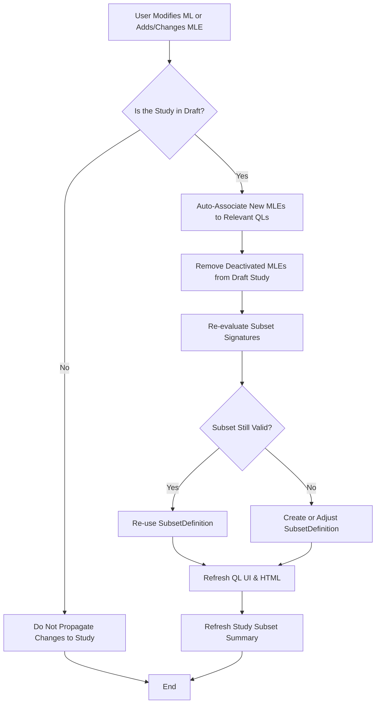

```mermaid
flowchart TD

    A1[User Modifies ML or Adds/Changes MLE] --> B1{Is the Study in Draft?}

    B1 -->|No| C1[Do Not Propagate Changes to Study]
    C1 --> Z1[End]

    B1 -->|Yes| D1[Auto-Associate New MLEs to Relevant QLs]
    D1 --> E1[Remove Deactivated MLEs from Draft Study]
    E1 --> F1[Re-evaluate Subset Signatures]

    F1 --> G1{Subset Still Valid?}
    G1 -->|Yes| H1[Re-use SubsetDefinition]
    G1 -->|No| I1[Create or Adjust SubsetDefinition]

    H1 --> J1[Refresh QL UI & HTML]
    I1 --> J1

    J1 --> K1[Refresh Study Subset Summary]
    K1 --> Z1[End]
```