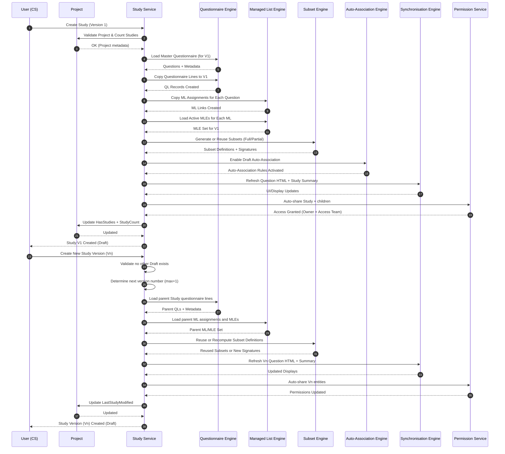

```mermaid
sequenceDiagram
    autonumber
    participant U as User (CS)
    participant P as Project
    participant S as Study Service
    participant Q as Questionnaire Engine
    participant ML as Managed List Engine
    participant SB as Subset Engine
    participant AA as Auto-Association Engine
    participant SY as Synchronisation Engine
    participant SEC as Permission Service

    %% --- V1 Creation ---
    U->>S: Create Study (Version 1)
    S->>P: Validate Project & Count Studies
    P-->>S: OK (Project metadata)

    S->>Q: Load Master Questionnaire (for V1)
    Q-->>S: Questions + Metadata

    S->>Q: Copy Questionnaire Lines to V1
    Q-->>S: QL Records Created

    S->>ML: Copy ML Assignments for Each Question
    ML-->>S: ML Links Created

    S->>ML: Load Active MLEs for Each ML
    ML-->>S: MLE Set for V1

    S->>SB: Generate or Reuse Subsets (Full/Partial)
    SB-->>S: Subset Definitions + Signatures

    S->>AA: Enable Draft Auto-Association
    AA-->>S: Auto-Association Rules Activated

    S->>SY: Refresh Question HTML + Study Summary
    SY-->>S: UI/Display Updates

    S->>SEC: Auto-share Study + children
    SEC-->>S: Access Granted (Owner + Access Team)

    S->>P: Update HasStudies + StudyCount
    P-->>S: Updated

    S-->>U: Study V1 Created (Draft)

    %% --- Vn Creation ---
    U->>S: Create New Study Version (Vn)
    S->>S: Validate no other Draft exists

    S->>S: Determine next version number (max+1)

    S->>Q: Load parent Study questionnaire lines
    Q-->>S: Parent QLs + Metadata

    S->>ML: Load parent ML assignments and MLEs
    ML-->>S: Parent ML/MLE Set

    S->>SB: Reuse or Recompute Subset Definitions
    SB-->>S: Reused Subsets or New Signatures

    S->>SY: Refresh Vn Question HTML + Summary
    SY-->>S: Updated Displays

    S->>SEC: Auto-share Vn entities
    SEC-->>S: Permissions Updated

    S->>P: Update LastStudyModified
    P-->>S: Updated

    S-->>U: Study Version (Vn) Created (Draft)
```